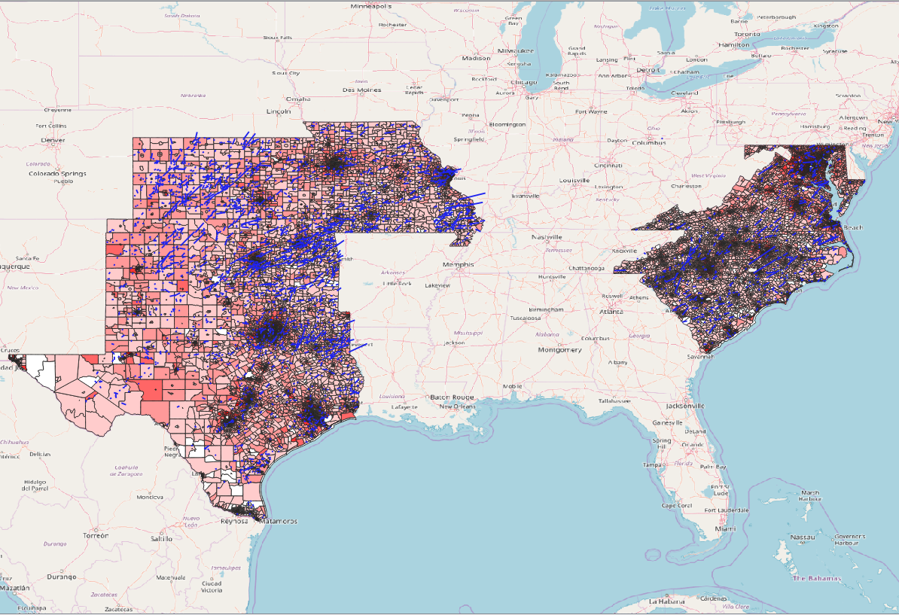

# GIS Internship Project
Maria Rochford

## Goal:
My goal for this project is to look at eight different states in the US and compare the median household income of each block group in each state. I also brought in data for tornadoes in the states from 2010-2017. The dataset of these storms include monetary damage as well as fatalities and injuries. I want to look and see if a greater amount of damage correlates with a lower income rate.

## Step 1
Adding the data.This is an example of how I added the data for one of the states using what I learned in GES 486 through python.
```python
layer = iface.addVectorLayer('Z:/GIS_Internship/2011_ACS_5YR_BG_24_MARYLAND/2011_ACS_5YR_BG_24_MARYLAND.shp', 'Median Household Income', 'ogr')
```
## Step 2
I need to classify the data so that it shows each block group by it's median household income. I classified all eight states into six categories:

    0.00 - 25,000.00
    
    25,000.1 - 50,000.00
    
    50,000.01 - 75,000.00
    
    75,000.01 - 100,000.00
    
    100,000.01 - 150,000.00
    
    150,000.01 - 210,000.00
    
Then I added in the tornado paths and it looks like this:



I was able to compare the damages done by the storm to the median household income by doing a spatial join.


I then ran each state individually though GeoDa. I ran a Moran's I test to see if a higher amount of damage correlated to a lower median household incomelike my hypothesis predicts. 


**Maryland**


**Virginia**


**North Carolina**


**South Carolina**


**Missouri**


**Kansas**


**Oklahoma**


**Texas**


**Conclusion:**

My findings concluded that my hypothesis was incorrect. It seems that there is little to no correlation between the amount of damage done by a storm and the median household income. This could be because many storms can pass though an area that only effects a small number of people while other storms pass through an area where many people are living such as a city. Sometimes these storm tracks are narrow and can only hit specific parts of a neighborhood such as a section where the majority of people living there are grouped in high or low income neighborhoods. 

