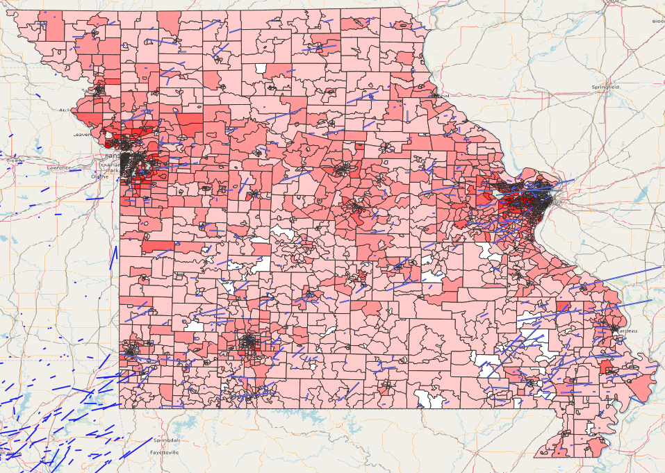

# Final Project
Maria Rochford

## Goal:
My goal for this project is to look at eight different states in the US and compare the median household income of each block group in each state. I also brought in data for tornadoes in the states from 2010-2017. The dataset of these storms include monetary damage as well as fatalities and injuries. I want to look and see if a greater amount of damage correlates with a lower income rate.

## Step 1
Adding the data.This is an example of how I added the data for one of the states
```python
layer = iface.addVectorLayer('Z:/GIS_Internship/2011_ACS_5YR_BG_24_MARYLAND/2011_ACS_5YR_BG_24_MARYLAND.shp', 'Median Household Income', 'ogr')
```
## Step 2
I need to classify the data so that it shows each block group by it's median household income. This is for one state. I figured out how to do this using python instead of just QGIS.
```python
from qgis.PyQt import QtGui

myVectorPath = ('Z:/GIS_Internship/2011_ACS_5YR_BG_24_MARYLAND/2011_ACS_5YR_BG_24_MARYLAND.shp')
myName = ('MedianHouseholdIncome')
myVectorLayer = QgsVectorLayer(myVectorPath, myName, 'ogr')
myTargetField = 'B19013e1'
myRangeList = []
myOpacity = 1
# First Range
myMin = 0.0
myMax = 25000.0
myLabel = '0 - 25,000'
myColour = QtGui.QColor('#fff5f0')
mySymbol1 = QgsSymbol.defaultSymbol(myVectorLayer.geometryType())
mySymbol1.setColor(myColour)
mySymbol1.setOpacity(myOpacity)
myRange1 = QgsRendererRange(myMin, myMax, mySymbol1, myLabel)
myRangeList.append(myRange1)
# Second Range
myMin2 = 25000.1
myMax2 = 50000.0
myLabel2 = '25,000 - 50,000'
myColour2 = QtGui.QColor('#fdcab5')
mySymbol2 = QgsSymbol.defaultSymbol(myVectorLayer.geometryType())
mySymbol2.setColor(myColour2)
mySymbol2.setOpacity(myOpacity)
myRange2 = QgsRendererRange(myMin2, myMax2, mySymbol2, myLabel2)
myRangeList.append(myRange2)
# Third Range
myMin3 = 50000.1
myMax3 = 75000.0
myLabel3 = '50,000 - 75,000'
myColour3 = QtGui.QColor('#fc8a6a')
mySymbol3 = QgsSymbol.defaultSymbol(myVectorLayer.geometryType())
mySymbol3.setColor(myColour3)
mySymbol3.setOpacity(myOpacity)
myRange3 = QgsRendererRange(myMin3, myMax3, mySymbol3, myLabel3)
myRangeList.append(myRange3)
# Fourth Range
myMin4 = 75000.1
myMax4 = 100000.0
myLabel4 = '75K - 100K'
myColour4 = QtGui.QColor('#f96245')
mySymbol4 = QgsSymbol.defaultSymbol(myVectorLayer.geometryType())
mySymbol4.setColor(myColour4)
mySymbol4.setOpacity(myOpacity)
myRange4 = QgsRendererRange(myMin4, myMax4, mySymbol4, myLabel4)
myRangeList.append(myRange4)
# Fifth Range
myMin5 = 100000.1
myMax5 = 250000.0
myLabel5 = '100K - 250K'
myColour5 = QtGui.QColor('#d42020')
mySymbol5 = QgsSymbol.defaultSymbol(myVectorLayer.geometryType())
mySymbol5.setColor(myColour5)
mySymbol5.setOpacity(myOpacity)
myRange5 = QgsRendererRange(myMin5, myMax5, mySymbol5, myLabel5)
myRangeList.append(myRange5)

myRenderer = QgsGraduatedSymbolRenderer('', myRangeList)
myRenderer.setMode(QgsGraduatedSymbolRenderer.EqualInterval)
myRenderer.setClassAttribute(myTargetField)

myVectorLayer.setRenderer(myRenderer)
QgsProject.instance().addMapLayer(myVectorLayer)
```
Then I added in the tornado paths and it looks like this:


I was able to compare the damages done by the storm to the median household income by doing a spatial join.


I then ran each state individually though GeoDa. I ran a Moran's I test to see if a higher amount of damage correlated to a lower median household incomelike my hypothesis predicts. 


**Maryland**


**Virginia**


**North Carolina**


**South Carolina**


**Missouri**




**Kansas**


**Oklahoma**


**Texas**


**Conclusion:**

My findings concluded that my hypothesis was incorrect. It seems that there is little to no correlation between the amount of damage done by a storm and the median household income. This could be because many storms can pass though an area that only effects a small number of people while other storms pass through an area where many people are living such as a city. Sometimes these storm tracks are narrow and can only hit specific parts of a neighborhood such as a section where the majority of people living there are grouped in high or low income neighborhoods. 

