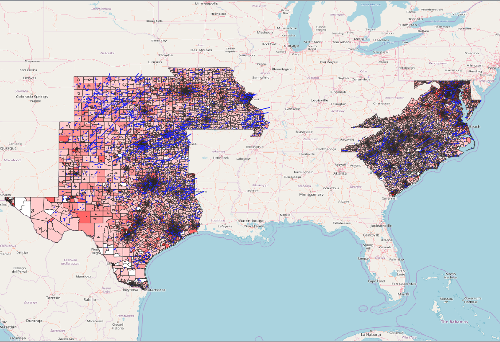

<!--This is the first row of projects -->

### GIS Internship Project

[See more details here.](https://github.com/maria-45/maria-45.io/blob/master/GIS_Internship/gis_internship.md)

My goal for this project is to look at eight different states in the US and compare the median household income of each block group in each state. I also brought in data for tornadoes in the states from 2010-2017. The dataset of these storms include monetary damage as well as fatalities and injuries. I want to look and see if a greater amount of damage correlates with a lower income rate. 

<small>__Tools__: QGIS, R, GeoDa, Python

